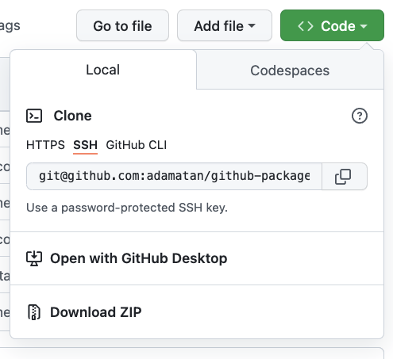

# Python Packaging Test

A sample repo for testing how to install a Python package from source from a GH repo.

## How to Install This Package

The full pip reference page about VCS support [is available here](https://pip.pypa.io/en/stable/topics/vcs-support/).

The URL format is:

```bash
protocol://REPO-URL#egg=<package_name>&subdirectory=<repo_subdirectory>
```

For example,let's take
1. Protocol: `git+https`
1. URL: `git@github.com:adamatan/github-packages-python.git`. We will replace `:adamatan` with `/adamatan`.
1. The package name is defined in [`setup.cfg`](./packaging_tutorial/setup.cfg) to be `example-pkg-adamatan`.
1. The package subdirectory is `packaging_tutorial`.

The URL should be wrapped with quotes to escape the `&`. So we get:

```bash
pip install "git+https://git@github.com/adamatan/github-packages-python.git#subdirectory=packaging_tutorial&egg=example-pkg-adamatan"
```

## Troubleshooting
I've tested this with Python 3.9. You can use `make docker` to test the installation on a clean environment.

## How to get the repo URL?
Hit `Code` above and choose ssh or HTTPS.


